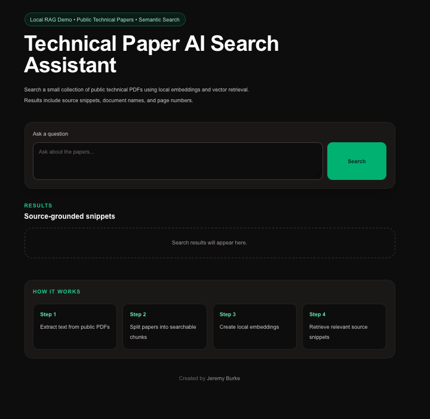
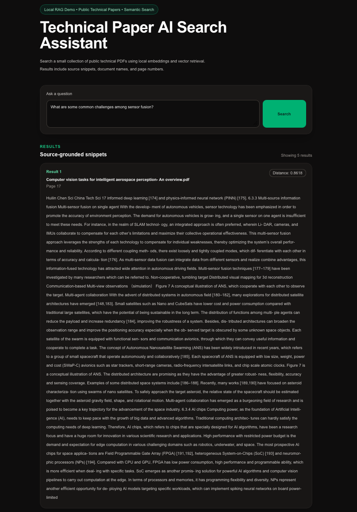

# Technical Paper AI Search

A local semantic search demo for public technical PDFs. Ask natural-language questions and get source-grounded snippets with document names, page numbers, and similarity scores — no cloud APIs required.

**Created by Jeremy Burke**

## Screenshots

### Initial UI

Empty state before running a search — question input, search button, and placeholder for results.



### Search results

Semantic retrieval returns ranked snippets with document name, page number, and similarity distance.



## Project overview

This project indexes a small collection of public research PDFs about autonomous systems, computer vision, and spacecraft autonomy. It extracts text, splits it into overlapping chunks, embeds them with a local sentence-transformer model, and stores vectors in ChromaDB. A FastAPI backend serves search queries; a Next.js frontend provides a simple UI for exploring results.

The goal is not production-scale RAG, but a clear, end-to-end reference for how retrieval works: ingest → embed → store → query → display citations.

## Why I built it

- **Learn RAG fundamentals** — See the full pipeline in a small codebase without managed vector DBs or hosted LLM APIs.
- **Stay local** — Embeddings and search run on your machine; papers stay in `data/pdfs`.
- **Show provenance** — Every hit includes the PDF name, page number, and raw snippet so you can verify answers against the source.
- **Portfolio-friendly** — Easy to demo: ingest once, run two terminals, search from the browser.

## Features

- PDF text extraction with PyMuPDF
- Word-based chunking with overlap (900 words, 150 overlap)
- Local embeddings via `all-MiniLM-L6-v2`
- Persistent vector store with ChromaDB
- REST search API (`POST /search`)
- Interactive CLI search (`backend/search.py`)
- Next.js UI with semantic search, ranked results, and a “How it works” walkthrough

## Architecture

```
┌─────────────────┐     POST /search      ┌──────────────────┐
│  Next.js UI     │ ────────────────────► │  FastAPI (api.py)│
│  localhost:3000 │                       │  localhost:8000  │
└─────────────────┘                       └────────┬─────────┘
                                                   │
                    encode query + vector query    │
                                                   ▼
                                          ┌──────────────────┐
                                          │  ChromaDB        │
                                          │  data/chroma/    │
                                          └──────────────────┘
                                                   ▲
                                                   │ ingest
                                          ┌──────────────────┐
                                          │  ingest.py       │
                                          │  PDFs → chunks   │
                                          │  → embeddings    │
                                          └──────────────────┘
```

**Data flow**

1. **Ingest** — `ingest.py` reads PDFs from `data/pdfs/`, chunks each page, writes `data/processed/chunks.json`, and rebuilds the Chroma collection.
2. **Search** — The API encodes the user question, queries Chroma for nearest chunks, and returns metadata (document, page, distance).
3. **Display** — The frontend renders snippets and lets you refine questions without re-ingesting.

## Tech stack

| Layer | Tools |
|-------|--------|
| Frontend | Next.js 16, React 19, TypeScript, Tailwind CSS 4 |
| API | FastAPI, Uvicorn, Pydantic |
| Embeddings | [sentence-transformers](https://www.sbert.net/) (`all-MiniLM-L6-v2`) |
| Vector DB | [ChromaDB](https://www.trychroma.com/) (persistent local store) |
| PDF parsing | PyMuPDF (`fitz`) |
| Runtime | Python 3.13+ (backend), Node.js 20+ (frontend) |

## Project structure

```
technical-paper-ai-search/
├── images/             # README screenshots
├── backend/
│   ├── api.py          # FastAPI app + /search endpoint
│   ├── ingest.py       # PDF → chunks → Chroma
│   ├── search.py       # CLI search loop
│   └── requirements.txt
├── frontend/
│   └── app/page.tsx    # Search UI
├── data/
│   ├── pdfs/           # Source PDFs (add your own)
│   ├── processed/      # chunks.json (generated)
│   └── chroma/         # Vector store (generated)
└── README.md
```

## Local setup

### Prerequisites

- Python 3.13+
- Node.js 20+
- ~500MB disk for Python deps and the embedding model (first run downloads weights)

### 1. Backend

```bash
cd backend
python3 -m venv .venv
source .venv/bin/activate   # Windows: .venv\Scripts\activate
pip install -r requirements.txt
```

Place public PDFs in `data/pdfs/`, then ingest:

```bash
python ingest.py
```

Start the API:

```bash
uvicorn api:app --reload --port 8000
```

Verify: [http://localhost:8000](http://localhost:8000) should return `{"status":"ok",...}`.

### 2. Frontend

In a second terminal:

```bash
cd frontend
npm install
npm run dev
```

Open [http://localhost:3000](http://localhost:3000). The UI calls `http://localhost:8000/search` — both services must be running.

### 3. Optional CLI search

```bash
cd backend
source .venv/bin/activate
python search.py
```

Type a question at the prompt; enter `quit` to exit.

### Adding or updating papers

1. Copy PDFs into `data/pdfs/`.
2. Re-run `python ingest.py` (this deletes and recreates the Chroma collection).
3. Restart the API if it was already running (model and collection load at startup).

## Example questions

These work well with the included papers on autonomous vehicles, aerospace computer vision, and deep-space spacecraft modeling:

- What are the main challenges in autonomous systems?
- How is computer vision used in aerospace perception?
- What is the difference between functional-level and system-level autonomy?
- What tradeoffs exist when choosing onboard model fidelity for spacecraft?
- What subsystems are analyzed for deep-space autonomous exploration?
- How do optical navigation and trajectory maintenance work during cruise?
- What limitations does PDF text extraction introduce for search?

## Limitations

- **Retrieval only** — No LLM answer synthesis; you get ranked chunks, not a generated summary.
- **Small corpus** — Quality depends entirely on the PDFs in `data/pdfs/`; out-of-domain questions return weak matches.
- **PDF text quality** — Scanned or heavily formatted PDFs may extract poorly; chunk boundaries can split sentences awkwardly.
- **Fixed chunking** — 900-word windows with 150-word overlap; not tuned per document type.
- **Single embedding model** — `all-MiniLM-L6-v2` is fast and local but not SOTA for technical jargon.
- **Cold start** — First API request loads the transformer model into memory (can take several seconds).
- **Hardcoded API URL** — Frontend points at `http://localhost:8000`; no env-based config yet.
- **No auth or multi-user** — Local demo only.

## Future improvements

- [ ] Add an LLM step to synthesize answers with citations from retrieved chunks
- [ ] Environment variables for API base URL and CORS origins
- [ ] Hybrid search (BM25 + vectors) for better keyword matches on technical terms
- [ ] Per-PDF ingest status and collection stats endpoint
- [ ] Smarter chunking (by section headings, semantic splits)
- [ ] Support uploading PDFs from the UI
- [ ] Docker Compose for one-command startup
- [ ] Evaluation notebook (recall@k on a small labeled question set)
- [ ] Cache query embeddings and warm the model on API startup

## License

Use and modify for learning and demos. Ensure any PDFs you add comply with their original licenses and terms of use.
