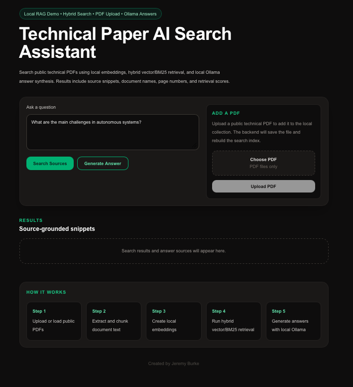
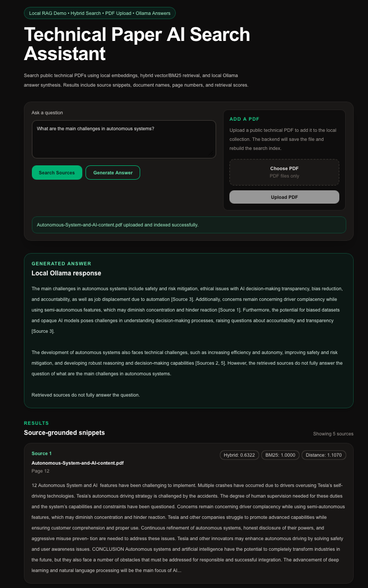

# Technical Paper AI Search

A local technical-paper search assistant for public PDFs. Ask natural-language questions, retrieve source-grounded snippets, generate local LLM answers, and upload new PDFs for re-indexing. No paid cloud APIs required.

**Created by Jeremy Burke**

## Screenshots

### Enhanced UI

Question input, local answer generation, PDF upload, and source retrieval interface.



### Source-grounded results

Hybrid retrieval returns ranked source snippets with document name, page number, vector distance, BM25 score, and hybrid score.



## Project Overview

This project indexes a small collection of public research PDFs about autonomous systems, computer vision, spacecraft autonomy, and related technical topics. It extracts text from PDFs, splits pages into overlapping chunks, embeds the chunks with a local sentence-transformer model, stores vectors in ChromaDB, and supports hybrid retrieval using both vector similarity and BM25 keyword relevance.

A FastAPI backend provides semantic search, hybrid-ranked retrieval, local Ollama-based answer generation, and PDF upload/re-indexing. A Next.js frontend provides a simple interface for asking questions, uploading PDFs, generating answers, and reviewing source snippets.

It is a clear, end-to-end local reference for how document retrieval works:

```text
PDFs → text extraction → chunking → embeddings → vector store → hybrid retrieval → local LLM answer → source display
```

## Why I Built It

- **Learn RAG fundamentals** : See the full retrieval pipeline in a small codebase without managed vector databases or paid hosted LLM APIs.
- **Stay local** : Embeddings, vector search, and answer generation run locally. Documents stay in `data/pdfs/`.
- **Show provenance** : Each result includes document name, page number, raw source snippet, and retrieval scores.
- **Demonstrate practical AI tooling** : The project connects document processing, embeddings, vector search, keyword search, backend APIs, local LLMs, and a web interface.
- **Portfolio-friendly** : The project uses public PDFs and non-sensitive workflows to demonstrate implementation ability.

## Current Features

- Public PDF ingestion with PyMuPDF
- PDF text extraction and overlapping chunk generation
- Local embedding generation with `sentence-transformers`
- Persistent local vector storage with ChromaDB
- BM25 keyword retrieval with `rank-bm25`
- Hybrid vector + BM25 search ranking
- Local LLM answer synthesis with Ollama
- Source-grounded answers with retrieved excerpts
- PDF upload from the frontend
- Automatic local index rebuild after upload
- FastAPI backend with `/search`, `/answer`, and `/upload` endpoints
- Next.js frontend with search, answer generation, upload, and source display

## Architecture

```text
┌─────────────────────────┐
│      Next.js UI         │
│   localhost:3000        │
│                         │
│ - Ask question          │
│ - Upload PDF            │
│ - Generate answer       │
│ - Display sources       │
└───────────┬─────────────┘
            │
            │ POST /search
            │ POST /answer
            │ POST /upload
            ▼
┌─────────────────────────┐
│      FastAPI API        │
│   localhost:8000        │
│                         │
│ - Hybrid retrieval      │
│ - Upload handling       │
│ - Index rebuild         │
│ - Ollama answer call    │
└───────┬─────────┬───────┘
        │         │
        │         │ POST /api/generate
        │         ▼
        │  ┌─────────────────────┐
        │  │       Ollama        │
        │  │  localhost:11434    │
        │  │  llama3.2:3b        │
        │  └─────────────────────┘
        │
        ▼
┌─────────────────────────┐
│   Retrieval Indexes     │
│                         │
│ - Chroma vector store   │
│ - BM25 keyword index    │
│ - PDF metadata          │
└───────────┬─────────────┘
            ▲
            │
┌───────────┴─────────────┐
│       ingest.py         │
│                         │
│ PDFs → chunks →         │
│ embeddings → Chroma     │
└─────────────────────────┘
```

## Data Flow

1. **Ingest PDFs**  
   `ingest.py` reads PDFs from `data/pdfs/`, extracts page text, creates overlapping chunks, writes `data/processed/chunks.json`, generates embeddings, and rebuilds the Chroma collection.

2. **Search sources**  
   The API embeds the user question, queries Chroma for semantic similarity, scores chunks with BM25 keyword retrieval, combines both scores into a hybrid ranking, and returns source snippets.

3. **Generate answer**  
   The `/answer` endpoint retrieves top sources, sends them with the user question to local Ollama, and returns a concise answer grounded in the retrieved excerpts.

4. **Upload PDF**  
   The `/upload` endpoint saves a new PDF to `data/pdfs/`, rebuilds the local index, reloads Chroma/BM25 indexes, and makes the new document searchable.

5. **Display results**  
   The frontend shows the generated answer, source snippets, document names, page numbers, and retrieval scores.

## API Endpoints

| Endpoint | Method | Purpose |
|---|---:|---|
| `/` | GET | Health check |
| `/search` | POST | Hybrid vector/BM25 source retrieval |
| `/answer` | POST | Local Ollama answer generation with sources |
| `/upload` | POST | Upload PDF and rebuild local index |

Example `/answer` request:

```json
{
  "question": "What are the main challenges in autonomous systems?",
  "n_results": 5
}
```

Example `/answer` response:

```json
{
  "question": "What are the main challenges in autonomous systems?",
  "answer": "Generated local answer from retrieved sources...",
  "sources": [
    {
      "id": "example-p3-c1",
      "document": "example.pdf",
      "page": 3,
      "snippet": "Relevant source text...",
      "distance": 0.42,
      "bm25_score": 0.71,
      "hybrid_score": 0.68
    }
  ]
}
```

## Tech Stack

| Layer | Tools |
|---|---|
| Frontend | Next.js, React, TypeScript, Tailwind CSS |
| API | FastAPI, Uvicorn, Pydantic |
| PDF parsing | PyMuPDF |
| Embeddings | `sentence-transformers` with `all-MiniLM-L6-v2` |
| Vector database | ChromaDB local persistent store |
| Keyword search | `rank-bm25` |
| Local LLM | Ollama with `llama3.2:3b` |
| Runtime | Python 3.13+, Node.js 20+ |

## Project Structure

```text
technical-paper-ai-search/
├── images/                  # README screenshots
├── backend/
│   ├── api.py               # FastAPI app: /search, /answer, /upload
│   ├── ingest.py            # PDF → chunks → embeddings → Chroma
│   ├── search.py            # Optional CLI search loop
│   └── requirements.txt
├── frontend/
│   └── app/page.tsx         # Search, answer, upload UI
├── data/
│   ├── pdfs/                # Source PDFs
│   ├── processed/           # Generated chunks.json
│   └── chroma/              # Generated Chroma vector store
└── README.md
```

## Local Setup

### Prerequisites

- Python 3.13+
- Node.js 20+
- Ollama installed locally
- `llama3.2:3b` pulled in Ollama
- Public PDFs placed in `data/pdfs/`

Install Ollama on macOS with Homebrew:

```bash
brew install ollama
```

Start Ollama once, then pull the model in another terminal:

```bash
ollama serve
```

```bash
ollama pull llama3.2:3b
```

## Running the App Locally

This project uses a **three-terminal setup**.

### Terminal 1 : Start Ollama

```bash
ollama serve
```

Keep this terminal running. Ollama serves the local LLM at:

```text
http://localhost:11434
```

### Terminal 2 : Start the FastAPI Backend

```bash
cd backend
python3 -m venv .venv
source .venv/bin/activate
pip install -r requirements.txt
```

Place public PDFs in:

```text
data/pdfs/
```

Build the initial index:

```bash
python ingest.py
```

Start the API:

```bash
uvicorn api:app --reload --port 8000
```

Verify the backend:

```text
http://localhost:8000
```

API docs:

```text
http://localhost:8000/docs
```

### Terminal 3 : Start the Next.js Frontend

```bash
cd frontend
npm install
npm run dev
```

Open the UI:

```text
http://localhost:3000
```

## Using the App

1. Start Ollama.
2. Start the FastAPI backend.
3. Start the Next.js frontend.
4. Ask a question and click **Search Sources** to retrieve hybrid-ranked snippets.
5. Click **Generate Answer** to create a local Ollama answer from retrieved sources.
6. Upload a public PDF using the upload panel.
7. Ask a question about the new PDF after indexing completes.

## Adding or Updating Papers

There are two ways to add PDFs.

### Option 1 : Use the frontend upload

1. Choose a public PDF in the upload panel.
2. Click **Upload PDF**.
3. The backend saves the file and rebuilds the local index.
4. Search or generate answers from the updated collection.

### Option 2 : Add PDFs manually

1. Copy PDFs into `data/pdfs/`.
2. Re-run ingestion:

```bash
cd backend
source .venv/bin/activate
python ingest.py
```

3. Restart the API if it was already running.

## Example Questions

These work well with public papers on autonomous systems, computer vision, AI, and spacecraft autonomy:

- What are the main challenges in autonomous systems?
- How is computer vision used in aerospace perception?
- What is the difference between functional-level and system-level autonomy?
- What tradeoffs exist when choosing onboard model fidelity for spacecraft?
- What subsystems are analyzed for deep-space autonomous exploration?
- How do optical navigation and trajectory maintenance work during cruise?
- What limitations does PDF text extraction introduce for search?
- How do the sources discuss verification and validation for AI systems?

## Notes on Local Data

Generated local data is stored in:

```text
data/processed/
data/chroma/
```

These folders are generated and can be rebuilt from the PDFs.

If you delete a PDF manually from `data/pdfs/`, run `python ingest.py` again to remove it from the Chroma and BM25 indexes. Manual file deletion does not automatically update the search index.

## Limitations

- **Local demo only** : This is not a deployed multi-user application.
- **Requires three local services** : Ollama, FastAPI, and Next.js must all be running.
- **Small corpus** : Result quality depends on the PDFs available in `data/pdfs/`.
- **PDF extraction quality varies** : Scanned or heavily formatted PDFs may extract poorly.
- **Fixed chunking** : Uses 900-word chunks with 150-word overlap.
- **Single embedding model** : `all-MiniLM-L6-v2` is fast and local but not optimized for all technical domains.
- **Local LLM limitations** : Ollama answers are grounded in retrieved snippets but should still be checked against the source excerpts.
- **Hardcoded local API URL** : The frontend currently points to `http://localhost:8000`.
- **No authentication or document permissions** : Only use public, non-sensitive PDFs.

## Future Improvements

- [ ] Environment variables for API base URL, CORS origins, and Ollama model
- [ ] PDF collection stats endpoint
- [ ] Per-PDF ingest status and upload progress
- [ ] Smarter chunking by sections/headings
- [ ] Source highlighting inside retrieved snippets
- [ ] Docker Compose for one-command local startup
- [ ] Evaluation notebook with recall@k and answer-quality checks
- [ ] Query embedding cache and model warmup
- [ ] Optional deployment architecture for frontend/backend split

## License

Use and modify for learning and demos. Ensure any PDFs you add comply with their original licenses and terms of use.
