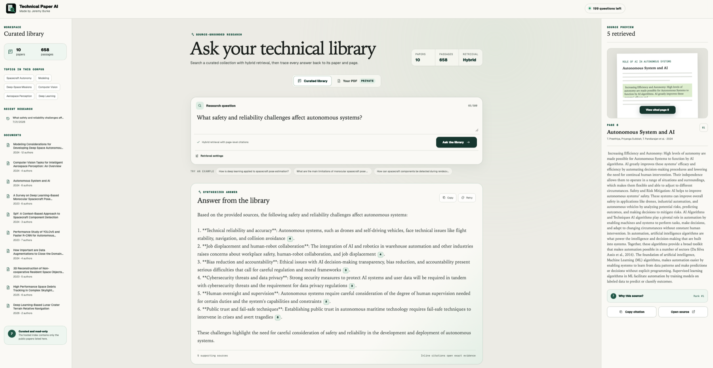
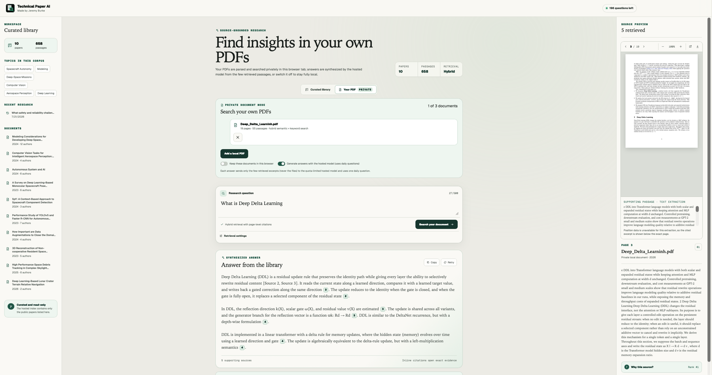

# Technical Paper AI Search

A source-grounded research assistant for aerospace autonomy research, live on
Cloudflare's free tier. Ask natural-language questions against a curated
library of spacecraft autonomy and aerospace computer-vision papers, stream
grounded answers whose citations open the exact cited PDF page with the
passage highlighted — or upload your own PDFs and get the same treatment,
with parsing and search running privately in your browser.

**Live demo:** https://technical-paper-ai-search.jeremy-burke024.workers.dev

**Made by Jeremy Burke**

## Screenshots

### Curated library

Streamed, source-grounded answers over the hosted corpus. Every inline
citation opens the cited page in a PDF viewer with the exact supporting
passage highlighted, alongside the retrieval explanation for that source.



### Your own PDFs, privately

Visitor documents are parsed, chunked, and embedded entirely inside a Web
Worker in the browser — the file never touches a server. Answers are
synthesized by the hosted model from the few retrieved excerpts (on by
default and clearly labeled; one toggle switches to fully local search where
nothing is transmitted).



## What it does

- **Hybrid retrieval with explanations** — semantic search (Workers AI
  BGE-small + Vectorize) and BM25 keyword ranking fused with reciprocal-rank
  fusion; every source carries its semantic/keyword ranks, RRF contributions,
  and matched query concepts.
- **Streamed grounded answers** — Workers AI Llama 3.2 synthesizes answers
  constrained to the retrieved passages, with inline `[Source N]` citations.
- **Exact-passage citation highlighting** — chunk bounding boxes are computed
  at ingestion time and rendered as overlays on the cited PDF page.
- **Private browser-local PDF mode** — up to 3 documents (20 MB / 200 pages
  each) parsed with PDF.js and embedded with Transformers.js MiniLM inside a
  Web Worker, searched with the same hybrid BM25 + semantic RRF formula as
  the hosted corpus, with opt-in IndexedDB persistence.
- **Zero-cost by design** — the entire demo runs on Cloudflare Free-plan
  services with no payment method on the account, protected by a fail-closed
  quota circuit breaker.

## Architecture

One Cloudflare Worker serves both the static Next.js export and the API from
a single origin. The corpus and sparse index ship inside the Worker bundle,
so the hosted runtime has no Python, no external vector database, and no
server-side document storage.

```text
Next.js static export (same-origin /api)
            │
            ▼
Cloudflare Worker
  ├── D1 quota circuit breaker (fail-closed, global + per-browser caps)
  ├── Workers AI BGE-small query embedding
  ├── Vectorize semantic candidates ─┐
  ├── Bundled BM25 sparse candidates ─┤→ reciprocal-rank fusion
  └── Workers AI Llama 3.2 streamed grounded answer
            │
            ▼
Structured citations with page numbers and highlight coordinates
```

The browser-local mode is its own pipeline in a dedicated Web Worker:

```text
PDF file → PDF.js text extraction → section-aware chunking
        → Transformers.js MiniLM embeddings (quantized, ~25 MB, cached)
        → hybrid BM25 + semantic RRF (same formula as hosted)
        → optional hosted synthesis of the top excerpts only
```

## Zero-cost guardrails

The hosted demo operates under a hard zero-cost ceiling, enforced by a D1
quota ledger that fails closed whenever its state is uncertain:

- At most **200 hosted questions per UTC day** globally, **20 per browser**,
  with a short burst limit per minute.
- When capacity is exhausted, hosted answering pauses until midnight UTC; the
  site, corpus browsing, citations, and fully local document search remain
  available.
- A kill switch in D1 can disable the demo instantly without a deploy.

Details: [zero-cost operating guardrails](COST_GUARDRAILS.md),
[failure drills](docs/FAILURE_DRILLS.md),
[deployment runbook](docs/DEPLOYMENT.md), and the
[implementation plan](docs/IMPLEMENTATION_PLAN.md).

## Corpus

**10 papers · 658 section-aware passages** covering spacecraft autonomy,
monocular spacecraft pose estimation, spacecraft component detection, orbital
domain-gap augmentation, NeRF reconstruction of space objects, space debris
tracking, and lunar terrain-relative navigation. Papers added after launch
are arXiv publications under CC BY 4.0 with metadata taken from the arXiv
API. One additional PDF is excluded because its extracted text duplicates
another paper; the exclusion is recorded in
[`data/corpus-manifest.json`](data/corpus-manifest.json) rather than silently
inflating the count.

Ingestion (PyMuPDF) computes deterministic chunks and per-passage highlight
boxes; CI rebuilds the corpus from the committed PDFs and fails if a single
byte differs.

## Retrieval evaluation

A 59-question, page-targeted baseline over the 10-paper corpus
([questions](evaluation/questions.json) ·
[measured output](evaluation/baseline.json)):

| Metric | Baseline |
|---|---:|
| Recall@5 | 1.0000 |
| Mean reciprocal rank@5 | 0.8404 |
| Duplicate-result rate | 0.0000 |
| Citation-page accuracy | 1.0000 |
| Missing-metadata rate | 0.0000 |

Reproduce it offline with the locally cached embedding model:

```bash
HF_HUB_OFFLINE=1 TRANSFORMERS_OFFLINE=1 \
  backend/.venv/bin/python evaluation/evaluate.py
```

## Privacy model

- The hosted index contains only the public papers listed in the library;
  there is no upload endpoint and no server-side document persistence.
- Research history lives only in the visitor's browser (localStorage).
- A visitor's own PDF is parsed, chunked, embedded, indexed, and searched
  entirely inside a Web Worker in their browser. The file never reaches the
  Worker, Cloudflare storage, or any owner-controlled service. Opt-in
  persistence uses the browser's own IndexedDB.
- Hosted answer generation for a local document transmits only the retrieved
  excerpts (at most 5 × 800 characters) through the same global quota gate as
  every other inference route. It is on by default and clearly labeled; one
  click switches to fully local search where nothing is transmitted. The
  Playwright suite asserts that no request ever carries document bytes.
- The local embedding model (~25 MB, quantized MiniLM) is fetched once from a
  public model CDN; the visitor's document is not part of that request. If
  the download fails, local search degrades to keyword-only ranking and says
  so.

## Quality gates

- **39 Worker tests** — request validation, every quota denial code,
  provider failures, mid-stream interruption, prompt-injection guards, CORS,
  and quota-bypass proofs across all four POST routes.
- **17 frontend unit tests** — chunking edge cases, local RRF fusion, and a
  Safari-compatibility polyfill exercised with the native API removed.
- **50 Playwright scenarios** on desktop and mobile — streaming, retry and
  exhaustion states, citation navigation, keyboard-only drawer usage, local
  PDF indexing/search/removal, and network-isolation assertions (live-model
  scenarios are gated behind `LIVE_MODEL=1`).
- **Accessibility** — axe WCAG A/AA scans with zero violations, Lighthouse
  accessibility 100, focus trapping, and reduced-motion support.
- **CI on every push** — corpus determinism gate, Worker tests + typecheck +
  wrangler dry run, frontend lint/unit/build, and the full Playwright suite,
  all on mocked bindings with no paid calls.

## Repository layout

```text
technical-paper-ai-search/
├── worker/              # Cloudflare Worker: API, quota breaker, bundled corpus
│   ├── src/             #   routes, retrieval, D1 quota logic
│   └── test/            #   39 Worker tests (mocked bindings)
├── frontend/            # Next.js static export
│   ├── app/             #   research workspace UI
│   ├── components/      #   answer, sources, PDF viewer, local-mode panel
│   ├── lib/local-documents/  # browser-local pipeline (Web Worker)
│   └── e2e/             #   Playwright suites
├── backend/             # Offline ingestion tooling (PyMuPDF, corpus build)
├── scripts/             # Corpus + Worker asset builders
├── data/                # Source PDFs, corpus.json, manifest
├── evaluation/          # 59-question eval set, baseline, quality gates
└── docs/                # Runbooks, drills, implementation plan, screenshots
```

## Development

```bash
# Frontend (UI work; e2e suites mock the hosted API)
cd frontend && npm ci && npm run dev

# Worker tests and typecheck
cd worker && npm ci && npm test && npm run typecheck

# Full local verification battery
cd frontend && npm run lint && npm run test:unit && npm run build && npx playwright test

# Rebuild the deterministic corpus after changing data/papers.json or PDFs
python3 scripts/build_corpus.py && python3 scripts/build_worker_assets.py
python3 evaluation/check_corpus_quality.py
```

### Deploy

Deployment is manual and separate from git — CI never deploys.

```bash
cd frontend && npm run build     # static export → frontend/out
cd ../worker && npx wrangler deploy
```

See the [deployment runbook](docs/DEPLOYMENT.md) for provisioning,
verification, and the emergency shutdown procedure.

## Limitations

- **Capacity over availability** — the hosted demo hard-stops at its daily
  quota and fails closed whenever quota state is uncertain; exhaustion lasts
  until midnight UTC by design.
- **Mid-sized corpus** — the evaluation covers ten papers in one thematic
  area and does not establish performance on large or heterogeneous
  collections.
- **Scanned PDFs unsupported in local mode** — browser-local ingestion needs
  selectable text; OCR is not implemented.
- **Heuristic section detection** — complex typography and multi-column
  layouts can produce imperfect section labels.
- **Small hosted model** — Llama 3.2 3B answers are grounded in retrieved
  passages but should still be checked against the cited excerpts.
- **No authentication or document permissions** — treat the hosted library
  as public; use the local mode's fully-local toggle for sensitive documents.

## Future improvements

- [ ] OCR support for scanned documents in browser-local mode
- [ ] Answer-grounding and citation-quality metrics for the generation stage
- [ ] Highlight coordinates for local-document citations
