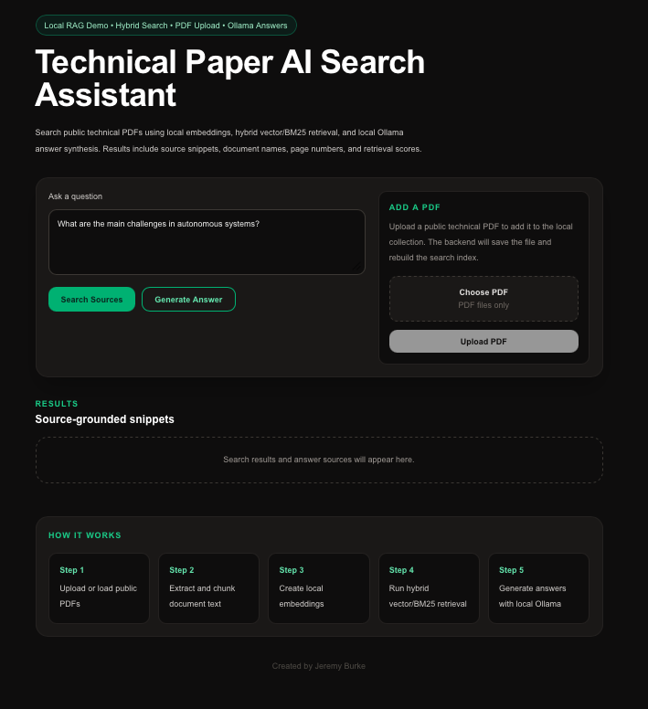
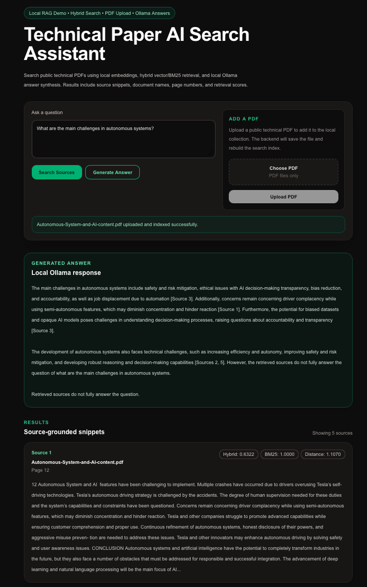

# Technical Paper AI Search

A source-grounded research assistant for technical papers. Ask
natural-language questions against a curated corpus with hybrid retrieval
(semantic + BM25 fused with reciprocal-rank fusion), stream grounded answers
with clickable citations that open the exact cited PDF page, and privately
search your own PDF entirely in your browser.

**Live demo:** https://technical-paper-ai-search.jeremy-burke024.workers.dev

**Created by Jeremy Burke**

The hosted demo runs exclusively on Cloudflare Free-plan services under a hard
zero-cost operating ceiling: at most 200 hosted questions per UTC day
globally, 20 per browser, enforced by a fail-closed D1 quota circuit breaker.
When capacity is exhausted, hosted answering pauses until midnight UTC while
the site, citations, and the browser-local document mode remain available.
See the [implementation plan](docs/IMPLEMENTATION_PLAN.md), the
[zero-cost operating guardrails](COST_GUARDRAILS.md), the
[failure drills](docs/FAILURE_DRILLS.md), and the
[deployment runbook](docs/DEPLOYMENT.md).

## Screenshots

### Enhanced UI

Question input, local answer generation, PDF upload, and source retrieval interface.



### Source-grounded results

Hybrid retrieval returns ranked source snippets with document name, page number, vector distance, BM25 score, and hybrid score.



## Project Overview

This project indexes a small collection of public research PDFs about autonomous systems, computer vision, spacecraft autonomy, and related technical topics. It extracts text from PDFs, splits pages into overlapping chunks, embeds the chunks with a local sentence-transformer model, stores vectors in ChromaDB, and supports hybrid retrieval using both vector similarity and BM25 keyword relevance.

A FastAPI backend provides semantic search, hybrid-ranked retrieval, local Ollama-based answer generation, and PDF upload/re-indexing. A Next.js frontend provides a simple interface for asking questions, uploading PDFs, generating answers, and reviewing source snippets.

It is a clear, end-to-end local reference for how document retrieval works:

```text
PDFs → text extraction → chunking → embeddings → vector store → hybrid retrieval → local LLM answer → source display
```

## Why I Built It

- **Learn RAG fundamentals** : See the full retrieval pipeline in a small codebase without managed vector databases or paid hosted LLM APIs.
- **Stay local** : Embeddings, vector search, and answer generation run locally. Documents stay in `data/pdfs/`.
- **Show provenance** : Each result includes document name, page number, raw source snippet, and retrieval scores.
- **Demonstrate practical AI tooling** : The project connects document processing, embeddings, vector search, keyword search, backend APIs, local LLMs, and a web interface.
- **Portfolio-friendly** : The project uses public PDFs and non-sensitive workflows to demonstrate implementation ability.

## Current Features

- Public PDF ingestion with PyMuPDF
- PDF text extraction and overlapping chunk generation
- Section-aware chunks with stable citation metadata
- Local embedding generation with `sentence-transformers`
- Persistent local vector storage with ChromaDB
- BM25 keyword retrieval with `rank-bm25`
- Hybrid vector + BM25 ranking with reciprocal-rank fusion
- Local LLM answer synthesis with Ollama
- Source-grounded answers with retrieved excerpts
- PDF upload from the frontend
- Automatic local index rebuild after upload
- FastAPI backend with `/search`, `/answer`, and `/upload` endpoints
- Next.js frontend with search, answer generation, upload, and source display
- Deployable Cloudflare Worker API using Workers AI, Vectorize, BM25/RRF, and
  structured citations
- Unified streamed research workflow with clickable citations, copy actions,
  retrieval controls, quota states, and browser-local history
- Lazy PDF.js citation viewer with exact-page navigation, zoom, downloads, and
  responsive desktop/mobile presentation
- Reproducible retrieval explanations with semantic/BM25 ranks, RRF
  contributions, retriever agreement, and matched query concepts
- Exact-passage citation highlighting: chunk bounding boxes are computed at
  ingestion time and rendered as overlays on the cited PDF page
- Private browser-local PDF mode (up to 3 documents at once): visitor
  documents are parsed, chunked,
  embedded (Transformers.js MiniLM), and searched with hybrid BM25 + semantic
  RRF entirely in a Web Worker, with opt-in IndexedDB persistence and
  strict size/page/chunk/timeout limits — the file never leaves the browser,
  and optional hosted synthesis sends only bounded excerpts through the same
  quota gate
- Production-grade quality gates: 39 Worker tests (validation, quota denial,
  provider failure, prompt-injection guards, CORS, quota-bypass proofs), 42
  Playwright flows across desktop and mobile, axe WCAG A/AA scans with zero
  violations, Lighthouse accessibility 100, drawer focus trapping, a corpus
  determinism gate, extended retrieval metrics in `evaluation/baseline.json`,
  documented failure drills, and a GitHub Actions pipeline that runs entirely
  on mocked bindings

## Architecture

The original local runtime remains available for private development. The
hosted Worker runtime is live at
https://technical-paper-ai-search.jeremy-burke024.workers.dev — one Worker
serves both the static Next.js export and the quota-protected API on the
Workers Free plan, with no payment method on the deployment account.

### Hosted runtime

```text
Next.js UI (same-origin /api)
            │
            ▼
Cloudflare Worker
  ├── Workers AI BGE-small query embedding
  ├── Vectorize semantic candidates
  ├── Bundled BM25 sparse candidates
  ├── Reciprocal-rank fusion
  └── Workers AI Llama 3.2 streamed grounded answer
            │
            ▼
Structured citations into the bundled 3-paper corpus
```

The production bundle contains the corpus and sparse index, so the hosted
runtime does not install Python, Torch, Chroma, Ollama, or the source PDFs. See
the [Worker API documentation](worker/README.md) for verification and
Free-plan provisioning instructions.

### Local runtime

```text
┌─────────────────────────┐
│      Next.js UI         │
│   localhost:3000        │
│                         │
│ - Ask question          │
│ - Upload PDF            │
│ - Generate answer       │
│ - Display sources       │
└───────────┬─────────────┘
            │
            │ POST /search
            │ POST /answer
            │ POST /upload
            ▼
┌─────────────────────────┐
│      FastAPI API        │
│   localhost:8000        │
│                         │
│ - Hybrid retrieval      │
│ - Upload handling       │
│ - Index rebuild         │
│ - Ollama answer call    │
└───────┬─────────┬───────┘
        │         │
        │         │ POST /api/generate
        │         ▼
        │  ┌─────────────────────┐
        │  │       Ollama        │
        │  │  localhost:11434    │
        │  │  llama3.2:3b        │
        │  └─────────────────────┘
        │
        ▼
┌─────────────────────────┐
│   Retrieval Indexes     │
│                         │
│ - Chroma vector store   │
│ - BM25 keyword index    │
│ - PDF metadata          │
└───────────┬─────────────┘
            ▲
            │
┌───────────┴─────────────┐
│       ingest.py         │
│                         │
│ PDFs → chunks →         │
│ embeddings → Chroma     │
└─────────────────────────┘
```

## Data Flow

1. **Ingest PDFs**  
   `ingest.py` reads PDFs from `data/pdfs/`, extracts page text, creates overlapping chunks, writes `data/processed/chunks.json`, generates embeddings, and rebuilds the Chroma collection.

2. **Search sources**  
   The API embeds the user question, queries Chroma for semantic similarity, scores chunks with BM25 keyword retrieval, combines both scores into a hybrid ranking, and returns source snippets.

3. **Generate answer**  
   The `/answer` endpoint retrieves top sources, sends them with the user question to local Ollama, and returns a concise answer grounded in the retrieved excerpts.

4. **Upload PDF**  
   The `/upload` endpoint saves a new PDF to `data/pdfs/`, rebuilds the local index, reloads Chroma/BM25 indexes, and makes the new document searchable.

5. **Display results**  
   The frontend shows the generated answer, source snippets, document names, page numbers, and retrieval scores.

## API Endpoints

| Endpoint | Method | Purpose |
|---|---:|---|
| `/` | GET | Health check |
| `/search` | POST | Hybrid vector/BM25 source retrieval |
| `/answer` | POST | Local Ollama answer generation with sources |
| `/upload` | POST | Upload PDF and rebuild local index |

Example `/answer` request:

```json
{
  "question": "What are the main challenges in autonomous systems?",
  "n_results": 5
}
```

Example `/answer` response:

```json
{
  "question": "What are the main challenges in autonomous systems?",
  "answer": "Generated local answer from retrieved sources...",
  "sources": [
    {
      "id": "example-p3-c1",
      "document": "example.pdf",
      "page": 3,
      "snippet": "Relevant source text...",
      "distance": 0.42,
      "bm25_score": 0.71,
      "hybrid_score": 0.68
    }
  ]
}
```

## Tech Stack

| Layer | Tools |
|---|---|
| Frontend | Next.js, React, TypeScript, Tailwind CSS |
| API | FastAPI, Uvicorn, Pydantic |
| PDF parsing | PyMuPDF |
| Embeddings | `sentence-transformers` with `all-MiniLM-L6-v2` |
| Vector database | ChromaDB local persistent store |
| Keyword search | `rank-bm25` |
| Local LLM | Ollama with `llama3.2:3b` |
| Hosted API | Cloudflare Worker |
| Hosted embeddings/LLM | Workers AI |
| Hosted vector search | Cloudflare Vectorize |
| Hosted quota ledger | Cloudflare D1 (activated in Phase 3) |
| Runtime | Python 3.13+, Node.js 20+ |

## Project Structure

```text
technical-paper-ai-search/
├── images/                  # README screenshots
├── backend/
│   ├── api.py               # FastAPI app: /search, /answer, /upload
│   ├── ingest.py            # PDF → chunks → embeddings → Chroma
│   ├── search.py            # Optional CLI search loop
│   └── requirements.txt
├── frontend/
│   └── app/page.tsx         # Search, answer, upload UI
├── data/
│   ├── pdfs/                # Source PDFs
│   ├── processed/           # Generated chunks.json
│   └── chroma/              # Generated Chroma vector store
└── README.md
```

## Local Setup

### Prerequisites

- Python 3.13+
- Node.js 20+
- Ollama installed locally
- `llama3.2:3b` pulled in Ollama
- Public PDFs placed in `data/pdfs/`

Install Ollama on macOS with Homebrew:

```bash
brew install ollama
```

Start Ollama once, then pull the model in another terminal:

```bash
ollama serve
```

```bash
ollama pull llama3.2:3b
```

## Running the App Locally

This project uses a **three-terminal setup**.

### Terminal 1 : Start Ollama

```bash
ollama serve
```

Keep this terminal running. Ollama serves the local LLM at:

```text
http://localhost:11434
```

### Terminal 2 : Start the FastAPI Backend

```bash
cd backend
python3 -m venv .venv
source .venv/bin/activate
pip install -r requirements.txt
```

Place public PDFs in:

```text
data/pdfs/
```

Build the initial index:

```bash
python ingest.py
```

Start the API:

```bash
uvicorn api:app --reload --port 8000
```

Verify the backend:

```text
http://localhost:8000
```

API docs:

```text
http://localhost:8000/docs
```

### Terminal 3 : Start the Next.js Frontend

```bash
cd frontend
npm install
NEXT_PUBLIC_API_BASE_URL=http://localhost:8000 npm run dev
```

Open the UI:

```text
http://localhost:3000
```

## Using the App

1. Start Ollama.
2. Start the FastAPI backend.
3. Start the Next.js frontend.
4. Ask a question and click **Search Sources** to retrieve hybrid-ranked snippets.
5. Click **Generate Answer** to create a local Ollama answer from retrieved sources.
6. Upload a public PDF using the upload panel.
7. Ask a question about the new PDF after indexing completes.

## Adding or Updating Papers

There are two ways to add PDFs.

### Option 1 : Use the frontend upload

1. Choose a public PDF in the upload panel.
2. Click **Upload PDF**.
3. The backend saves the file and rebuilds the local index.
4. Search or generate answers from the updated collection.

### Option 2 : Add PDFs manually

1. Copy PDFs into `data/pdfs/`.
2. Re-run ingestion:

```bash
cd backend
source .venv/bin/activate
python ingest.py
```

3. Restart the API if it was already running.

## Corpus and Retrieval Evaluation

The configured collection currently contains **10 unique papers and 658
section-aware chunks** covering spacecraft autonomy, monocular pose
estimation, spacecraft component detection, orbital domain-gap augmentation,
NeRF reconstruction of space objects, space debris tracking, and lunar
terrain-relative navigation. The seven papers added after launch are all
arXiv publications under CC BY 4.0 licenses with metadata taken from the
arXiv API. One additional PDF is excluded because its extracted text is
identical to the deep-space autonomy paper despite having a different,
incorrect filename. The exclusion is recorded in
[`data/corpus-manifest.json`](data/corpus-manifest.json) rather than silently
inflating the document count.

Rebuild the deterministic corpus:

```bash
backend/.venv/bin/python scripts/build_corpus.py
```

Rebuild the Chroma index from that corpus:

```bash
backend/.venv/bin/python backend/ingest.py
```

Run the retrieval evaluation offline using the locally cached embedding model:

```bash
HF_HUB_OFFLINE=1 TRANSFORMERS_OFFLINE=1 \
  backend/.venv/bin/python evaluation/evaluate.py
```

The 59-question, page-targeted baseline over the 10-paper corpus is:

| Metric | Baseline |
|---|---:|
| Recall@5 | 1.0000 |
| Mean reciprocal rank@5 | 0.8404 |
| Duplicate-result rate | 0.0000 |
| Citation-page accuracy | 1.0000 |
| Missing-metadata rate | 0.0000 |

The questions and expected paper/page matches are stored in
[`evaluation/questions.json`](evaluation/questions.json), and the complete
measured output is stored in
[`evaluation/baseline.json`](evaluation/baseline.json).

## Example Questions

These work well with public papers on autonomous systems, computer vision, AI, and spacecraft autonomy:

- What are the main challenges in autonomous systems?
- How is computer vision used in aerospace perception?
- What is the difference between functional-level and system-level autonomy?
- What tradeoffs exist when choosing onboard model fidelity for spacecraft?
- What subsystems are analyzed for deep-space autonomous exploration?
- How do optical navigation and trajectory maintenance work during cruise?
- What limitations does PDF text extraction introduce for search?
- How do the sources discuss verification and validation for AI systems?

## Notes on Local Data

Generated local data is stored in:

```text
data/processed/
data/chroma/
```

These folders are generated and can be rebuilt from the PDFs.

If you delete a PDF manually from `data/pdfs/`, run `python ingest.py` again to remove it from the Chroma and BM25 indexes. Manual file deletion does not automatically update the search index.

## Privacy Model

- The curated hosted index contains only the three public papers listed in the
  library; the hosted demo has no upload endpoint and no server-side document
  persistence.
- Research history lives only in the visitor's browser (localStorage) and is
  never transmitted.
- A visitor's own PDF is parsed, chunked, embedded, indexed, and searched
  entirely inside a Web Worker in their browser. The file never reaches the
  Worker, Cloudflare storage, or any owner-controlled service. Opt-in
  persistence uses the browser's own IndexedDB.
- Hosted answer generation for a local document is opt-in and transmits only
  the retrieved excerpts (at most 5 x 800 characters), through the same
  global quota gate as every other inference route.
- The local embedding model (~25 MB, quantized MiniLM) is fetched once from a
  public model CDN by the visitor's browser; the visitor's document is not
  part of that request. If the download fails, local search degrades to
  keyword-only ranking and says so.

## Limitations

- **Capacity over availability** : the hosted demo hard-stops at its daily
  quota (globally and per browser) and fails closed whenever quota state is
  uncertain; exhaustion lasts until midnight UTC by design.
- **Requires three local services for the legacy pipeline** : Ollama, FastAPI, and Next.js must all be running.
- **Mid-sized corpus** : The evaluation covers ten papers in one thematic
  area and does not establish performance on a large or heterogeneous
  collection.
- **PDF extraction quality varies** : Scanned or heavily formatted PDFs may extract poorly.
- **Heuristic section detection** : PDF typography and multi-column layouts can
  still produce imperfect section labels.
- **Single embedding model** : `all-MiniLM-L6-v2` is fast and local but not optimized for all technical domains.
- **Local LLM limitations** : Ollama answers are grounded in retrieved snippets but should still be checked against the source excerpts.
- **Separate local services** : The legacy local workflow still requires the
  frontend, FastAPI, and Ollama processes; the API origin is configured with
  `NEXT_PUBLIC_API_BASE_URL`.
- **Scanned PDFs unsupported in local mode** : browser-local ingestion needs
  selectable text; OCR is not implemented.
- **No authentication or document permissions** : Only use public, non-sensitive PDFs.

## Reproduction Commands

```bash
# Corpus determinism and quality gate (stdlib only)
python3 scripts/build_worker_assets.py
python3 evaluation/check_corpus_quality.py

# Retrieval evaluation (recall@5, MRR, duplicate/citation/metadata metrics)
backend/.venv/bin/python evaluation/evaluate.py

# Worker: 39 tests, typecheck, deployment dry run
cd worker && npm ci && npm test && npm run typecheck && npx wrangler deploy --dry-run

# Frontend: lint, unit tests, production static export, 42 Playwright flows
cd frontend && npm ci && npm run lint && npm run test:unit && npm run build && npm run test:e2e
```

## Future Improvements

- [x] Global hosted-demo quota circuit breaker
- [x] Browser-local PDF ingestion for the public demo
- [x] Add answer-grounding and citation-quality evaluation metrics
- [ ] Per-PDF ingest status for the legacy local pipeline
- [ ] Review and correct low-confidence section headings from complex layouts
- [ ] Coordinate-based source highlighting for more retrieved snippets
- [ ] OCR support for scanned documents in browser-local mode
